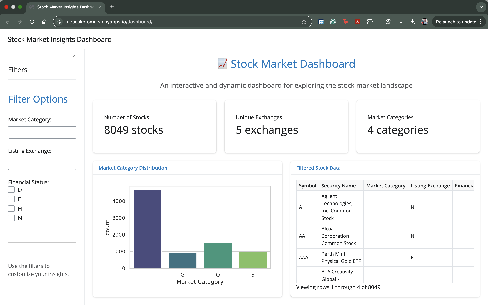

# 📈 Stock Market Insights Dashboard  
An interactive PyShiny web application for exploring and analyzing the U.S. stock market landscape.

---

## 🌟 Features

- **Interactive Filters**  
  Filter stocks dynamically by:
  - Market Category  
  - Listing Exchange  
  - Financial Status  

- **Dynamic Visualizations**  
  Real-time bar chart updates based on selected filters.

- **Actionable Insights**  
  Key performance indicators (KPIs) for:
  - Total number of stocks  
  - Unique stock exchanges  
  - Distinct market categories  

- **Interactive Data Table**  
  Explore filtered stock details in a searchable, structured format.

---

## 🗂️ Dataset

- **Source:** [Kaggle: Stock Market Dataset](https://www.kaggle.com/datasets)  
- **File Used:** `symbols_valid_meta.csv`  
- Contains metadata on thousands of U.S. stock listings including their financial status, exchange, and market classification.

---

## 🔧 Technologies Used

| Tool | Purpose |
|------|---------|
| **Python** | Backend logic and data manipulation |
| **PyShiny** | Building the interactive web app |
| **Pandas** | Data transformation and filtering |
| **Plotly** | Responsive and clean bar charts |
| **Faicons** | UI enhancement with clean iconography |

---

## 🚀 Getting Started

### 1. Clone the Repository
```bash
git clone https://github.com/mokeyzz1/cintel-06-custom.git
cd cintel-06-custom
```

### 2. Set Up a Virtual Environment
```bash
python3 -m venv .venv
source .venv/bin/activate  # On Windows: .venv\Scripts\activate
pip install -r requirements.txt
```

### 3. Run the Application
```bash
shiny run --reload --launch-browser dashboard/app.py
```

---

## 📊 Visual Output Overview

- **Bar Chart**  
  Market Category distribution updates based on user-selected filters.

- **Summary Metrics**  
  - Total number of stocks in view  
  - Count of unique exchanges  
  - Count of market categories

- **Data Table**  
  - View, search, and explore stock metadata
  - Auto-updates based on selected filters

---

## 📎 Screenshot Preview



---

## 👤 Author

**Moses Koroma**  
[Portfolio Website](https://moseskoroma.me) | [GitHub](https://github.com/mokeyzz1) | [LinkedIn](https://linkedin.com/in/mosesbkoroma)
